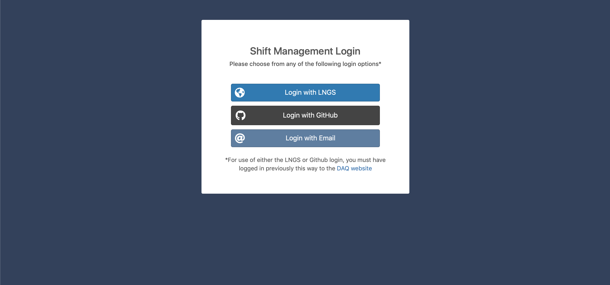

# XENON User Management

The XENON User Management website automates administrative processes for XENON, such as account creation, shift creation and maintenance, and notification systems. The User Management website is built using Node.js, Express and MongoDB and many of the interactive elements (such as calendars, graphs, and tables) are built using Javascript plug-ins (FullCalendar, HighCharts, and DataTables). Access to the website is limited to those that are in the XENON dark matter collaboration.
* [User Management Website](https://xenonnt.lngs.infn.it/shifts/)

## Status

The shift calendar feature was released on July 24, 2020. Therefore, the other pages are currently hidden from the menu bar. As new pages are released, they will be added to the menu bar for easy access. 

## Features
#### Login Page
Currently there are three ways to login: LNGS credentials, GitHub and local (email and password). In order to log in with LNGS or GitHub credentials, the user must first visit the DAQ website to link their accounts to their account. Upon success, the user is redirected to their profile page. If the login attempt fails, the user is shown an error message with details as to why.

#### Other Pages
##### The following pages are currently available to the XENON collaboration:
- Shift Calendar
  - Institute leaderboard to show how many shifts each institute has done
  - Calendar that allows users to sign up for shifts
- Profile
  - Allows users to update contact information

##### The following pages are available in the codebase but still under development:
- Full Directory
  - Tavke that displays list of all current and previous members of the collaboration
  - Automates account creation
  - Only select group of people will have permission to edit every member on the list.
- Individual Institutes 
  - Show some stats for the institute.
  - Allow those with permissions to add new members to the institute 
  - Automate emails that need to be sent out each time a user is added